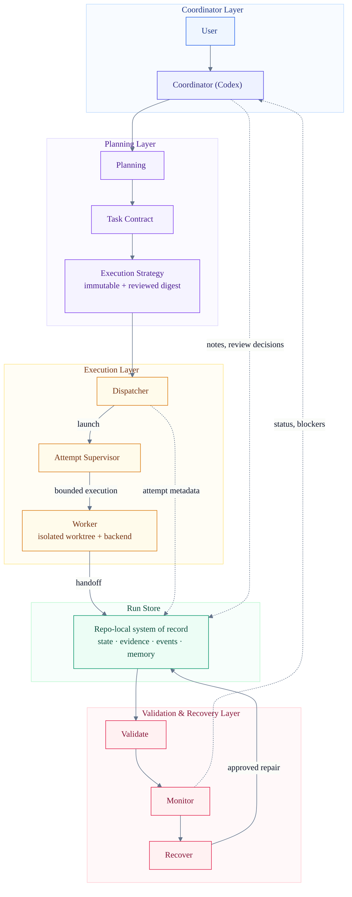
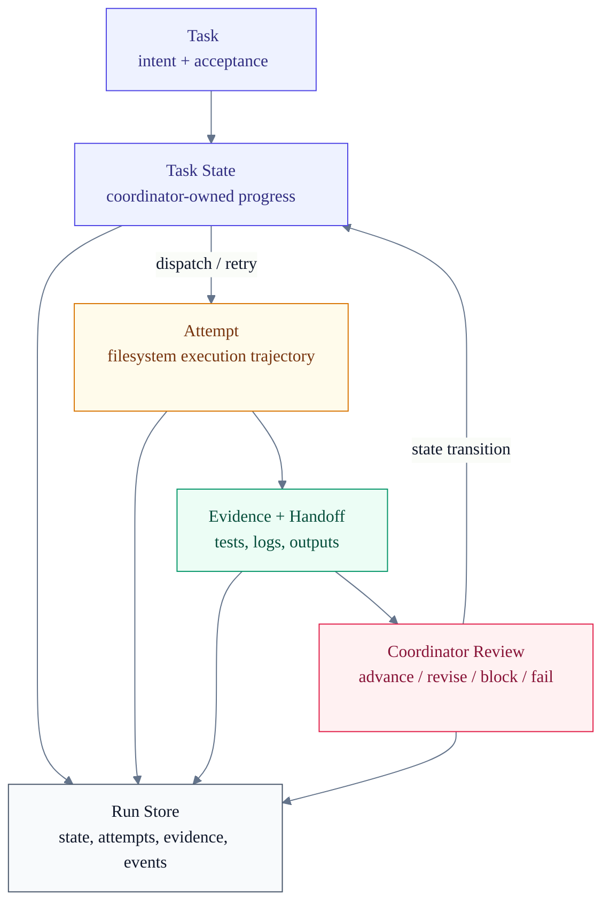
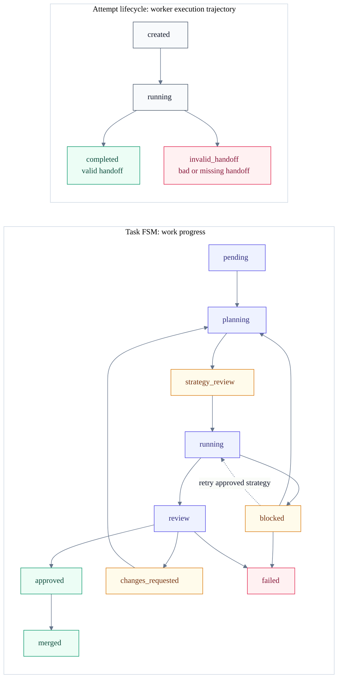

# research-dev-orchestrator

[](https://github.com/LKCY23/research-dev-orchestrator/actions/workflows/smoke.yml)

[English](README.md) | [简体中文](README.zh-CN.md)

A repo-local orchestration protocol for turning research ideas into reproducible experiment code with a role-neutral coordinator and CLI coding agents as workers.

Research code often evolves over weeks: requirements shift, baselines change, experiments fail, agents lose context, and results become hard to audit. `research-dev-orchestrator` gives Codex a lightweight way to manage that lifecycle without a server, database, queue, or daemon.

The runtime entrypoint is [SKILL.md](SKILL.md). The detailed design baseline is [DESIGN_SPEC.md](DESIGN_SPEC.md).

## Why This Exists

Short agent coding workflows are usually easy to inspect: one prompt, one patch, one review. Research and experiment development is different:

- Experiments span days or weeks.
- Requirements, datasets, baselines, and metrics change.
- Failed attempts matter because they explain why later decisions were made.
- Reproducibility artifacts are as important as implementation code.
- Review needs evidence, not just a diff.
- Humans and agents both forget context.

This project turns that long-running workflow into durable files inside the target repository.

## What It Is

`research-dev-orchestrator` is a Codex skill plus a set of scripts and protocol templates. It helps Codex:

- clarify requirements and experiment goals;
- choose a design method and record architecture decisions;
- create task packets with acceptance criteria and allowed paths;
- dispatch CLI coding agents such as Claude Code into isolated Git worktrees;
- review versioned worker execution strategies before code-writing attempts;
- supervise attempt process groups and bounded workflow/command budgets without a daemon;
- validate worker handoffs using deterministic protocol gates;
- collect status, evidence, diagnostics, and long-term memory;
- support evidence-based Codex/human review before merge.

It is intentionally small: the protocol is files plus Git.

## Core Design

The design is built around four rules:

1. **Coordinator owns intent**
   Requirements, experiment design, task decomposition, acceptance criteria, review, and merge decisions stay with the coordinator.

2. **Workers own execution**
   A worker receives one task packet, works in one branch/worktree, and publishes
   an immutable attempt-local evidence bundle plus a handoff request. Dispatch
   validates that bundle and owns the resulting `STATUS.json` transition.

3. **Filesystem is the protocol**
   Agents communicate through repo-local files such as `STATUS.json`, `ATTEMPT.json`, `EVENTS.ndjson`, and `JOURNAL.md`.

4. **Git is the isolation boundary**
   Each task uses an isolated branch/worktree. Workers do not merge.

## Architecture



The architecture is organized around ownership boundaries. The coordinator owns intent and review decisions. Planning workers propose immutable multi-workflow strategies; execution workers operate under an approved strategy digest and a deterministic attempt-local supervisor. Git isolates implementation changes. The Run Store is the repo-local system of record for task state, attempt lifecycle, handoff evidence, events, memory, results, and recovery context.

Implementation details are intentionally secondary in the diagram:

| Plane | Responsibility | Main implementation |
| --- | --- | --- |
| Coordinator | Requirements, design, task split, review, merge decisions | `SKILL.md`, `$research-dev-orchestrator` intent surface |
| Planning | Durable research intent and task contracts | `REQUIREMENTS.md`, `DESIGN_BRIEF.md`, `ADR/`, `EXPERIMENT_PLAN.md`, `TASK.md`, `ACCEPTANCE.md` |
| Execution | Strategy-gated dispatch, attempt supervision, Git-isolated execution | `dispatch_agent.sh`, `dispatch_claude.sh`, `dispatch_assets.py`, agent backend registry, plain/tmux runtimes, Git worktree |
| Run Store | Repo-local system of record for task state, attempt lifecycle, handoff evidence, event timeline, memory, results, and recovery context | `.agent-collab/runs/<run-id>/`, `STATUS.json`, attempt-local `TASK_INPUTS.json`/`EVIDENCE.json`/`HANDOFF.json`/`HANDOFF_READY.json`, `EVENTS.ndjson`, `JOURNAL.md`, `RESULT_LEDGER.md` |
| Validation & recovery | Deterministic gates, read-only audit, derived reports, user-approved recovery | `validation.py`, `protocol_cli.py`, `collect_status.py`, `SUMMARY.md`, `diagnostics/` |

## Workflow

The coordinator explicitly selects one of three execution profiles after
splitting the work to one primary trust boundary:

```text
Direct:    worker implement -> test -> self-review/fix -> verified -> merge gate
Delegated: worker implement -> test -> self-review/fix -> coordinator review -> merge gate
Full:      strategy planning -> coordinator strategy review -> execution -> coordinator review -> merge gate
```

Every profile keeps Git isolation, bounded attempt supervision, evidence, and validated handoff. See [execution profiles](references/execution-profiles.md).

Use Direct when local low-risk work can rely on worker self-review, Delegated
when the implementation is bounded but needs independent coordinator judgment,
and Full for high-risk, materially cross-module, or explicitly strategy-gated
work. Full adds pre-implementation strategy approval. File count, estimated
duration, or vague complexity never selects it automatically.

Merge is exposed through the coordinator-only `rdo task merge` command. Task
approval binds the exact reviewed commit; merge is clean, fast-forward-only,
idempotent, and recoverable from Git ancestry without adding a `MERGE.json`
protocol artifact.

A run captures the full lifecycle: requirements, design notes, experiment plans, tasks, attempts, reviews, results, diagnostics, and memory.

## Execution Strategy And Supervision

Full tasks use strategy-gated execution. A planning worker may inspect the repository but cannot modify the task worktree; it submits a versioned `STRATEGY-vNNN.json` containing configurable workflow definitions, dependencies, permissions, instance/concurrency limits, time budgets, and completion gates. Coordinator approval binds the exact strategy digest, not a mutable filename. Direct and Delegated tasks skip strategy planning.

Execution remains flexible inside that approved envelope. A worker may start multiple instances of approved workflows and use declared subagents, but new workflow kinds, wider paths or permissions, larger budgets, or unbounded search require a new strategy revision. `supervise_attempt.py` enforces the attempt wall clock and process cleanup independently of model timeout settings; `rdo exec` supervises non-acceptance workflow commands, while `rdo check` selects and records exact commands from the frozen acceptance contract. See [execution strategy](references/execution-strategy.md), [attempt supervision](references/attempt-supervision.md), and [tmux control](references/tmux-control.md).

After an attempt has finished, `rdo cleanup audit --attempt-dir <path>` provides
a read-only point-in-time check for processes that visibly retain its
supervision token lineage. It does not trust historical PIDs as ownership
evidence, does not treat an empty observation as an absolute containment proof,
and does not terminate anything.

Strategy revisions can explicitly reuse completed work across attempts and backend changes. Dispatch verifies the terminal source attempt, source workflow completion, and exact worktree digest, then exposes carried and remaining workflows through attempt-local `RESUME_CONTEXT.json`. Acceptance evidence is always regenerated in the current attempt.

Full strategies may also declare hard model-turn, token, cost, context, first-progress, and no-progress budgets. RDO enables them only for metrics the selected backend/I/O adapter can observe, records normalized usage in `runtime/USAGE.ndjson`, and terminates on violation. Independent review workflows require distinct observed reviewer agents and hashed review artifacts; the primary worker cannot self-attest independence.

Backend governance is durable and adapter-specific. Strategy schema v2 binds execution to one backend; dispatch compiles backend policy, task limits, and the approved strategy before acquiring the task lock. Claude Code and Kimi Code use attempt-local `PreToolUse` hooks, OpenCode uses an attempt-local `tool.execute.before` plugin, and Codex uses a best-effort Bash `PreToolUse` hook. All four consume the same generated read policy and deterministic CLI Context Broker; only their interception guarantees differ. Cumulative launch enforcement is optional and disabled by default for Claude/Codex, and is not imposed on Kimi/OpenCode. User-global CLI configuration is not edited. See [backend governance](references/backend-governance.md).

## Protocol Files

The target repository gets a local `.agent-collab/` directory:

```text
.agent-collab/
  rdo.toml
  runs/
    <run-id>/
      RUN.json
      SUMMARY.md
      dashboard.html
      EVENTS.ndjson
      JOURNAL.md
      EXPERIMENT_PLAN.md
      REPRODUCIBILITY.md
      RESULT_LEDGER.md
      tasks/
        <task-id>/
          TASK.md
          CONTEXT.md
          ACCEPTANCE.md
          EXECUTION_POLICY.json
          STATUS.json
          strategy/
            STRATEGY-v001.json
            REVIEW-v001.json
            CURRENT.json
          attempts/
            <attempt-id>/
              ATTEMPT.json
              TASK_INPUTS.json
              EVIDENCE.json
              HANDOFF.json
              prompt.md
              result.md
              runtime/
                HANDOFF_READY.json
                ARTIFACT_LOCK
                COMMANDS.ndjson
                transcript.log
                worktree-before.json
                worktree-after.json
```

Key files:

- `STATUS.json`: task progress and finite-state-machine state.
- `TASK.md`, `CONTEXT.md`, `ACCEPTANCE.md`, and
  `EXECUTION_POLICY.json`: the four canonical task inputs. Dispatch refuses an
  incomplete or inconsistent packet.
- `attempts/<attempt-id>/TASK_INPUTS.json`: immutable derived binding to those
  four inputs, the task base commit, and resolved dependency commits.
- `attempts/<attempt-id>/runtime/TASK_BUDGET.json`: optional immutable v2
  cumulative-budget admission snapshot with consumed/remaining attempts,
  pre-finalization execution time, and observable model cost.
- `ATTEMPT.json`: worker execution lifecycle and the exact `TASK_INPUTS.json`
  ref/digest for one attempt, plus the task-budget snapshot binding when used.
- `EVENTS.ndjson`: append-only machine-readable timeline.
- `JOURNAL.md`: human-readable session memory.
- `SUMMARY.md`: derived dashboard generated by `collect_status.py`.
- `dashboard.html`: derived human monitor generated by `render_dashboard.py`.
- `attempts/<attempt-id>/runtime/COMMANDS.ndjson`: raw supervised acceptance
  facts produced only by `rdo check`.
- `attempts/<attempt-id>/EVIDENCE.json`: frozen structured review index over
  command records, worktree facts, required-output Git blob/mode/content
  bindings, logs, generic artifacts, and reviewer evidence.
- `attempts/<attempt-id>/HANDOFF.json`: minimal machine-readable request for
  `strategy_review`, `verified`, `review`, or `blocked`.
- `attempts/<attempt-id>/runtime/HANDOFF_READY.json`: immutable publication
  marker written last. It asks the supervisor to quiesce the worker; it is not
  approval, merge, or an FSM transition.

Artifact Protocol v2 never creates task-root mutable handoff/evidence files.
Recognized v0.5/v1 runs remain readable through an explicit legacy decoder and
retain their historical `HANDOFF.md`, `EVIDENCE.md`, and `COMPLETION.json`
layout.

See [Artifact Protocol v2](references/artifact-protocol-v2.md),
[references/state-machine.md](references/state-machine.md),
[references/attempt-lifecycle.md](references/attempt-lifecycle.md), and
[references/events-schema.md](references/events-schema.md) for protocol details.

## Execution State Model: Tasks and Attempts

The execution state model separates work progress from worker execution.

A task is the durable work item: intent, constraints, acceptance criteria, and coordinator-owned progress. A worker is the logical execution owner. An attempt is one bounded supervision and audit slice, materialized with prompt, runtime metadata, transcript, result, evidence, and handoff request. New attempts normally resume the same worker, worktree, and native backend session.

Dispatch is the boundary between worker execution and task state. Direct and Delegated tasks enter execution immediately; Full tasks first pass immutable strategy review. Ordinary feedback creates a new attempt with `execution_mode=resume`; worker/backend replacement is explicit and recorded as `replace`.





Worker failure affects an attempt first, not the task directly. A completed attempt is a valid protocol handoff, not necessarily approval. This lets the system resume, inspect, compare, and recover execution slices without discarding worker context or task history.

## Agent And Runtime Backends

Artifact Protocol v2 preserves the worker/runtime split while using
attempt-local `HANDOFF_READY.json` as the publication signal for every new
attempt:

```text
worker backend  = claude-code | codex | opencode | kimi-code
runtime backend = plain | tmux
io mode         = machine | human
```

The supported runtime combinations are intentionally narrow:

```text
plain + machine
tmux + human
```

`plain + machine` performs a side-effect-free backend preflight before locking,
delivers the initial prompt through exactly one adapter-declared channel, and
requires a valid backend startup event within the configured startup timeout.
`tmux + human` launches an attachable TUI and records prompt submission as
best-effort evidence. After `rdo strategy submit|revise` or `rdo finalize`
publishes a validated attempt-bound READY marker, the supervisor quiesces the
TUI process group; coordinator review and final dispatch validation remain
separate.
Unsupported pairs fail before attempt, worktree, lock, or task-state mutation.

Backend command contracts live in `agent_backends/*.toml`; validate them with:

```bash
python scripts/agent_backend_cli.py validate --backend all
```

See [references/agent-backends.md](references/agent-backends.md).

## Runtime Backends

Two worker execution backends are supported:

- `plain`: default direct execution from `dispatch_agent.sh`.
- `tmux`: attachable execution for long-running workers.

The tmux backend is still synchronous from dispatch's protocol perspective. It is not a daemon, watcher, queue, or source of truth. Completion is determined by the attempt-local `exit_code` file and validated protocol files, not by tmux session state.

See [references/runtime-backends.md](references/runtime-backends.md) and [references/lock-recovery.md](references/lock-recovery.md).

## Long-Term Memory

Long-running research work needs explicit memory:

- `SUMMARY.md`: current dashboard.
- `JOURNAL.md`: human session notes and next actions.
- `EVENTS.ndjson`: append-only machine timeline.
- `RESULT_LEDGER.md`: experiment outcomes and claim support.
- `reviews/`: Codex/human review records.
- `tasks/*/attempts/`: worker execution records.

The goal is that a user or Codex can resume weeks later and answer: what changed, why it changed, what failed, what evidence exists, and what remains blocked.

## Installation

Install this repository as a Codex skill for the coordinator:

```bash
mkdir -p ~/.codex/skills
git clone https://github.com/LKCY23/research-dev-orchestrator.git \
  ~/.codex/skills/research-dev-orchestrator
```

Only the coordinator needs the skill installed. Claude Code or other CLI workers do not need to install this skill; they are launched by dispatch with task-packet paths and protocol instructions. A worker only needs the configured CLI backend available, for example:

```bash
claude --version
codex --version
opencode --version
kimi --version
```

For a cleaner final skill package, keep `SKILL.md`, `references/`, `scripts/`, `templates/`, and `agents/openai.yaml`; `README.md`, `DESIGN_SPEC.md`, `.github/`, and `tests/` are development artifacts.

## Quick Start

From a target repository, ask Codex to use the skill:

```text
Use $research-dev-orchestrator to initialize a run for a reproducible RAG benchmark pipeline.
```

You can also select the skill with Codex's built-in `/skills` picker, then ask for the same action in natural language. The examples here are skill invocations and intent phrases, not custom slash commands registered by the skill.

Codex should then:

1. clarify requirements and experiment details with you;
2. create a run under `.agent-collab/runs/<run-id>/`;
3. create task packets with acceptance criteria;
4. dispatch CLI workers when a task is ready;
5. collect status and review worker evidence;
6. update `SUMMARY.md`, `JOURNAL.md`, and related run artifacts at session closeout.

The worker side remains CLI-based. Configure defaults in `.agent-collab/rdo.toml` or with environment variables such as `RDO_WORKER_BACKEND`, `RDO_RUNTIME_BACKEND`, `RDO_PERMISSION_MODE`, and `RDO_TMUX_KEEP_SESSION`.

### Direct script usage

For development, debugging, or running without Codex skill discovery, clone this repository and call scripts by absolute path from the target repository:

```bash
git clone https://github.com/LKCY23/research-dev-orchestrator.git
export RESEARCH_DEV_ORCHESTRATOR_HOME=/path/to/research-dev-orchestrator
```

Initialize a run:

```bash
python "$RESEARCH_DEV_ORCHESTRATOR_HOME/scripts/init_run.py" \
  --project-slug rag-benchmark \
  --objective "Build a reproducible RAG benchmark pipeline" \
  --target-branch main
```

Create a task:

```bash
python "$RESEARCH_DEV_ORCHESTRATOR_HOME/scripts/create_task.py" \
  --run-id <run-id> \
  --task-id T001-data-loader \
  --goal "Implement the dataset loader and smoke tests" \
  --profile delegated \
  --allowed-paths src tests \
  --read-paths src tests pyproject.toml
```

`create_task.py` scaffolds a v2 packet; it does not invent deliverables,
invariants, interfaces, acceptance checks, or a profile. `--profile` is
required; Full must be selected explicitly. Before dispatch, complete all
required sections in `TASK.md`, `CONTEXT.md`, and `ACCEPTANCE.md`, including at
least one executable required command. Dispatch runs readiness before any
attempt, lock, worktree, or running-state mutation and rejects an incomplete
packet.

`read_paths` is a discovery boundary distinct from writable `allowed_paths`. If
omitted for a new task it defaults to `allowed_paths`. Put frozen decisions in
`CONTEXT.md` and list exceptional large documents explicitly in
`EXECUTION_POLICY.json.context_sources`; workers can retrieve bounded sections
through the deterministic Context Broker.
The broker and policy evaluator are backend-neutral and model-free. Backend
adapters translate supported native tool calls into that common policy. Across
all backends this is a deterministic efficiency, discovery-shaping, and audit
guardrail, not a confidentiality boundary or hostile filesystem sandbox;
shell/Python indirection, alternate tools, backend bugs, and unsupported native
surfaces may bypass it. Codex interception is additionally declared
best-effort because its stable hook surface is narrower.

Dispatch a worker:

```bash
"$RESEARCH_DEV_ORCHESTRATOR_HOME/scripts/dispatch_agent.sh" <run-id> T001-data-loader
```

Collect status:

```bash
python "$RESEARCH_DEV_ORCHESTRATOR_HOME/scripts/collect_status.py" --run-id <run-id>
python "$RESEARCH_DEV_ORCHESTRATOR_HOME/scripts/collect_status.py" --run-id <run-id> --write-summary
```

Close a session:

```bash
python "$RESEARCH_DEV_ORCHESTRATOR_HOME/scripts/close_session.py" \
  --run-id <run-id> \
  --summary "Implemented loader first pass and identified schema blocker."
```

## Example Usage

Use tmux when you want to attach to a long-running worker:

```bash
RDO_WORKER_BACKEND=opencode RDO_RUNTIME_BACKEND=tmux RDO_IO_MODE=human \
  "$RESEARCH_DEV_ORCHESTRATOR_HOME/scripts/dispatch_agent.sh" <run-id> T001-data-loader
```

Operational defaults live in `.agent-collab/rdo.toml`, but protocol truth is not configurable. Config may choose defaults such as backend, worker command, stale thresholds, and task path prefixes. It cannot change FSM states, blocker types, event types, protocol version, or review semantics.

See [references/configuration.md](references/configuration.md).

## Monitoring

The project has four monitor surfaces:

- Visual monitor: `.agent-collab/runs/<run-id>/dashboard.html`.
- Human-readable summary: `.agent-collab/runs/<run-id>/SUMMARY.md`.
- Interactive monitor: `python "$RESEARCH_DEV_ORCHESTRATOR_HOME/scripts/collect_status.py" --run-id <run-id>`.
- Machine-readable monitor: `python "$RESEARCH_DEV_ORCHESTRATOR_HOME/scripts/collect_status.py" --run-id <run-id> --json`.

Regenerate the visual dashboard and human-readable summary with:

```bash
python "$RESEARCH_DEV_ORCHESTRATOR_HOME/scripts/render_dashboard.py" \
  --run-id <run-id>
```

```bash
python "$RESEARCH_DEV_ORCHESTRATOR_HOME/scripts/collect_status.py" \
  --run-id <run-id> \
  --write-summary
```

`dashboard.html` and `SUMMARY.md` are derived monitors, not protocol truth. For
v2, the source of truth remains `RUN.json`, task `STATUS.json`, the current
attempt's `ATTEMPT.json`, `TASK_INPUTS.json`, `EVIDENCE.json`, `HANDOFF.json`,
and `runtime/HANDOFF_READY.json`, plus `EVENTS.ndjson` and
`RESULT_LEDGER.md`. Protocol warnings and recovery snapshots are written under
`diagnostics/`. Monitoring may label candidate bytes `rejected` after an
invalid handoff, but strict consumers still require a validated `published`
bundle. Recognized legacy-v0.5/v1 runs are resolved through their separate
historical artifact layouts.

## Versioning

This project tracks two versions in [VERSION](VERSION):

- `PACKAGE_VERSION`: the installable skill/repository release version.
- `PROTOCOL_VERSION`: the Run Store file protocol version written to `RUN.json`.

A package release declares the protocol version it implements, but patch releases may keep the same protocol version. Protocol version changes only when Run Store schemas, FSM transitions, event formats, or directory layout change.

## Validation and CI

CI runs automatically on pushes to `main` and on pull requests. It does not require secrets and does not call real model-backed workers.

The smoke tests use fake workers. They validate the protocol and orchestration behavior without consuming model/API budget:

- Python scripts compile.
- Bash scripts parse.
- Skill metadata is valid.
- Python unit tests and protocol smoke tests pass.
- `git diff --check` passes.

Local CI equivalent:

```bash
python3 .github/ci/quick_validate_skill.py .
python3 -m py_compile scripts/*.py .github/ci/quick_validate_skill.py
bash -n scripts/*.sh tests/smoke/*.sh
RDO_KEEP_SMOKE_REPOS=0 scripts/run_all_tests.sh
git diff --check
```

Use `scripts/run_unit_tests.sh` or `scripts/run_smoke_tests.sh` when only one
suite is relevant. For local smoke debugging, omit `RDO_KEEP_SMOKE_REPOS=0` to
keep temporary repositories.

## Repository Layout

```text
SKILL.md                 # Codex skill runtime entrypoint
README.zh-CN.md          # Simplified Chinese README
DESIGN_SPEC.md           # Full design baseline and protocol rationale
LICENSE                  # MIT license
VERSION                  # Package and Run Store protocol versions
CHANGELOG.md             # Release history
references/              # FSM, schemas, review rubric, workflow and memory docs
scripts/                 # protocol, config, validation, dispatch, collect, close_session
templates/               # Scaffold source for run and task files
tests/smoke/             # Protocol and dispatch smoke tests using fake workers
agents/openai.yaml       # Codex UI metadata
.github/workflows/       # GitHub Actions smoke CI
```

If packaging this as a final Codex skill, include `SKILL.md`, `references/`, `scripts/`, `templates/`, and `agents/openai.yaml`. `README.md`, `DESIGN_SPEC.md`, `.github/`, and `tests/` can remain development artifacts.

## Design Boundaries

This is not:

- a server;
- an RPC framework;
- a queue;
- a daemon;
- an automatic code reviewer;
- a replacement for Codex/human review;
- a system that automatically repairs corrupted protocol truth.

Agent writes are never trusted. Deterministic validation gates them. Validation may mark a handoff invalid, but semantic repair requires coordinator/user review.

## Roadmap

- Better installation packaging as a Codex skill.
- More protocol validators and recovery review helpers.
- Optional real-worker integration tests.
- More examples for research experiment workflows.
- Optional argv-array worker command mode.

## Contributing

Before opening a pull request, run the local CI equivalent above.

When changing protocol behavior:

- update the relevant files in `references/`;
- update smoke tests;
- keep constants in `scripts/protocol.py`;
- keep shared validation rules in `scripts/validation.py`;
- keep coordinator-only decisions out of `scripts/protocol_cli.py`.

Please do not add a server, daemon, RPC layer, queue, or automatic protocol repair without a design discussion.

## License

MIT. See [LICENSE](LICENSE).
