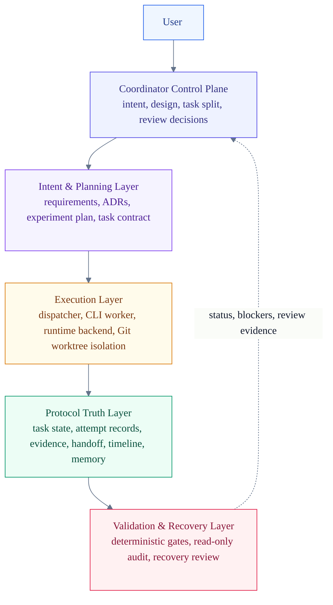
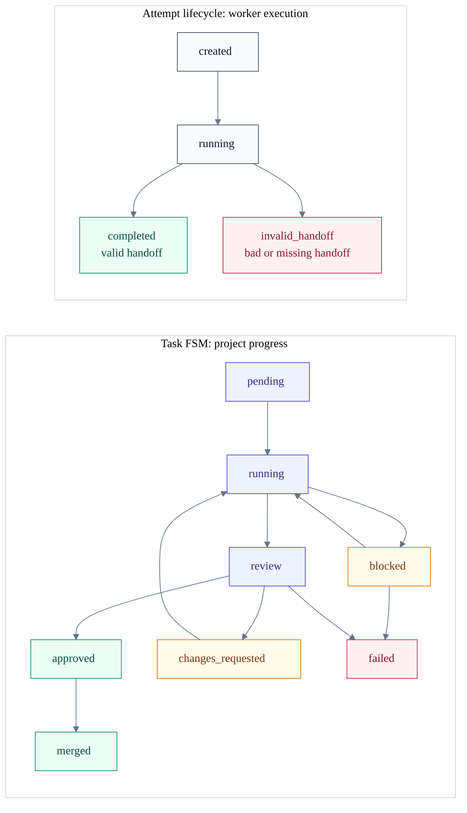

# research-dev-orchestrator

[](https://github.com/LKCY23/research-dev-orchestrator/actions/workflows/smoke.yml)

A repo-local orchestration protocol for turning research ideas into reproducible experiment code with Codex as the coordinator and CLI coding agents as workers.

Research code often evolves over weeks: requirements shift, baselines change, experiments fail, agents lose context, and results become hard to audit. `research-dev-orchestrator` gives Codex a lightweight way to manage that lifecycle without a server, database, queue, or daemon.

The runtime entrypoint is [SKILL.md](SKILL.md). The detailed design baseline is [DESIGN_SPEC.md](DESIGN_SPEC.md).

## Why This Exists

Short agent coding workflows are usually easy to inspect: one prompt, one patch, one review. Research and experiment development is different:

- Experiments span days or weeks.
- Requirements, datasets, baselines, and metrics change.
- Failed attempts matter because they explain why later decisions were made.
- Reproducibility artifacts are as important as implementation code.
- Review needs evidence, not just a diff.
- Humans and agents both forget context.

This project turns that long-running workflow into durable files inside the target repository.

## What It Is

`research-dev-orchestrator` is a Codex skill plus a set of scripts and protocol templates. It helps Codex:

- clarify requirements and experiment goals;
- choose a design method and record architecture decisions;
- create task packets with acceptance criteria and allowed paths;
- dispatch CLI coding agents such as Claude Code into isolated Git worktrees;
- validate worker handoffs using deterministic protocol gates;
- collect status, evidence, diagnostics, and long-term memory;
- support evidence-based Codex/human review before merge.

It is intentionally small: the protocol is files plus Git.

## Core Design

The design is built around four rules:

1. **Codex owns intent**
   Requirements, experiment design, task decomposition, acceptance criteria, review, and merge decisions stay with the coordinator.

2. **Workers own execution**
   A worker receives one task packet, works in one branch/worktree, and writes evidence plus a handoff.

3. **Filesystem is the protocol**
   Agents communicate through repo-local files such as `STATUS.json`, `ATTEMPT.json`, `EVENTS.ndjson`, and `JOURNAL.md`.

4. **Git is the isolation boundary**
   Each task uses an isolated branch/worktree. Workers do not merge.

## Architecture



The architecture is organized around ownership boundaries. The coordinator owns intent and review decisions. Workers own bounded execution. The filesystem stores protocol truth. Git isolates implementation changes. Validation gates worker handoffs and produces derived monitoring artifacts without becoming a long-running service.

Implementation details are intentionally secondary in the diagram:

| Layer | Responsibility | Main implementation |
| --- | --- | --- |
| Coordinator control plane | Requirements, design, task split, review, merge decisions | `SKILL.md`, `/rdo` command surface |
| Intent & planning | Durable research intent and task contracts | `REQUIREMENTS.md`, `DESIGN_BRIEF.md`, `ADR/`, `EXPERIMENT_PLAN.md`, `TASK.md`, `ACCEPTANCE.md` |
| Execution | Locking, worktree isolation, worker launch, attempt supervision | `dispatch_claude.sh`, `dispatch_assets.py`, plain/tmux backends |
| Protocol truth | Current state, attempt records, evidence, handoff, timeline, memory | `STATUS.json`, `ATTEMPT.json`, `EVIDENCE.md`, `HANDOFF.md`, `EVENTS.ndjson`, `JOURNAL.md` |
| Validation & recovery | Deterministic gates, read-only audit, derived reports, user-approved recovery | `validation.py`, `protocol_cli.py`, `collect_status.py`, `SUMMARY.md`, `diagnostics/` |

## Workflow

The intended flow is sequential but resumable:

```text
requirements
-> design method selection
-> architecture / experiment design
-> task packet
-> dispatch
-> worker handoff
-> collect status
-> Codex review
-> merge
-> close session
```

A run captures the full lifecycle: requirements, design notes, experiment plans, tasks, attempts, reviews, results, diagnostics, and memory.

## Protocol Files

The target repository gets a local `.agent-collab/` directory:

```text
.agent-collab/
  rdo.toml
  runs/
    <run-id>/
      RUN.json
      SUMMARY.md
      EVENTS.ndjson
      JOURNAL.md
      EXPERIMENT_PLAN.md
      REPRODUCIBILITY.md
      RESULT_LEDGER.md
      tasks/
        <task-id>/
          TASK.md
          CONTEXT.md
          ACCEPTANCE.md
          STATUS.json
          EVIDENCE.md
          HANDOFF.md
          attempts/
            <attempt-id>/
              ATTEMPT.json
              prompt.md
              transcript.log
              result.md
```

Key files:

- `STATUS.json`: task progress and finite-state-machine state.
- `ATTEMPT.json`: worker execution lifecycle for one attempt.
- `EVENTS.ndjson`: append-only machine-readable timeline.
- `JOURNAL.md`: human-readable session memory.
- `SUMMARY.md`: derived dashboard generated by `collect_status.py`.
- `EVIDENCE.md`: commands, tests, metrics, outputs, and logs.
- `HANDOFF.md`: worker handoff summary and known limitations.

See [references/state-machine.md](references/state-machine.md), [references/status-schema.md](references/status-schema.md), [references/attempt-lifecycle.md](references/attempt-lifecycle.md), and [references/events-schema.md](references/events-schema.md) for protocol details.

## Task vs Attempt

A task is not the same thing as an attempt.



Task state tracks project progress. Attempt state tracks one worker execution. This keeps the task FSM simple while preserving worker execution history. If a worker crashes, writes malformed protocol files, or exits without a valid handoff, the attempt can become `invalid_handoff` without inventing more task states.

## Runtime Backends

Two worker execution backends are supported:

- `plain`: default direct execution from `dispatch_claude.sh`.
- `tmux`: attachable execution for long-running workers.

The tmux backend is still synchronous from dispatch's protocol perspective. It is not a daemon, watcher, queue, or source of truth. Completion is determined by the attempt-local `exit_code` file and validated protocol files, not by tmux session state.

See [references/runtime-backends.md](references/runtime-backends.md) and [references/lock-recovery.md](references/lock-recovery.md).

## Long-Term Memory

Long-running research work needs explicit memory:

- `SUMMARY.md`: current dashboard.
- `JOURNAL.md`: human session notes and next actions.
- `EVENTS.ndjson`: append-only machine timeline.
- `RESULT_LEDGER.md`: experiment outcomes and claim support.
- `reviews/`: Codex/human review records.
- `tasks/*/attempts/`: worker execution records.

The goal is that a user or Codex can resume weeks later and answer: what changed, why it changed, what failed, what evidence exists, and what remains blocked.

## Quick Start

There is no package-manager install flow yet. Clone this repository and call scripts by absolute path from your target repository.

```bash
git clone https://github.com/LKCY23/research-dev-orchestrator.git
export RESEARCH_DEV_ORCHESTRATOR_HOME=/path/to/research-dev-orchestrator
```

From the target repository root:

```bash
python "$RESEARCH_DEV_ORCHESTRATOR_HOME/scripts/init_run.py" \
  --project-slug rag-benchmark \
  --objective "Build a reproducible RAG benchmark pipeline" \
  --target-branch main
```

Create a task:

```bash
python "$RESEARCH_DEV_ORCHESTRATOR_HOME/scripts/create_task.py" \
  --run-id <run-id> \
  --task-id T001-data-loader \
  --goal "Implement the dataset loader and smoke tests" \
  --allowed-paths src tests
```

Dispatch a worker:

```bash
"$RESEARCH_DEV_ORCHESTRATOR_HOME/scripts/dispatch_claude.sh" <run-id> T001-data-loader
```

Collect status:

```bash
python "$RESEARCH_DEV_ORCHESTRATOR_HOME/scripts/collect_status.py" --run-id <run-id>
python "$RESEARCH_DEV_ORCHESTRATOR_HOME/scripts/collect_status.py" --run-id <run-id> --write-summary
```

Close a session:

```bash
python "$RESEARCH_DEV_ORCHESTRATOR_HOME/scripts/close_session.py" \
  --run-id <run-id> \
  --summary "Implemented loader first pass and identified schema blocker."
```

## Example Usage

Use tmux when you want to attach to a long-running worker:

```bash
RDO_WORKER_BACKEND=tmux \
  "$RESEARCH_DEV_ORCHESTRATOR_HOME/scripts/dispatch_claude.sh" <run-id> T001-data-loader
```

Operational defaults live in `.agent-collab/rdo.toml`, but protocol truth is not configurable. Config may choose defaults such as backend, worker command, stale thresholds, and task path prefixes. It cannot change FSM states, blocker types, event types, protocol version, or review semantics.

See [references/configuration.md](references/configuration.md).

## Validation and CI

CI runs automatically on pushes to `main` and on pull requests. It does not require secrets and does not call real model-backed workers.

The smoke tests use fake workers. They validate the protocol and orchestration behavior without consuming model/API budget:

- Python scripts compile.
- Bash scripts parse.
- Skill metadata is valid.
- Protocol smoke tests pass.
- `git diff --check` passes.

Local CI equivalent:

```bash
python3 .github/ci/quick_validate_skill.py .
python3 -m py_compile scripts/*.py .github/ci/quick_validate_skill.py
bash -n scripts/dispatch_claude.sh scripts/run_smoke_tests.sh tests/smoke/*.sh
RDO_KEEP_SMOKE_REPOS=0 scripts/run_smoke_tests.sh
git diff --check
```

For local debugging, omit `RDO_KEEP_SMOKE_REPOS=0` to keep temporary smoke-test repositories.

## Repository Layout

```text
SKILL.md                 # Codex skill runtime entrypoint
DESIGN_SPEC.md           # Full design baseline and protocol rationale
references/              # FSM, schemas, review rubric, workflow and memory docs
scripts/                 # protocol, config, validation, dispatch, collect, close_session
templates/               # Scaffold source for run and task files
tests/smoke/             # Protocol and dispatch smoke tests using fake workers
agents/openai.yaml       # Codex UI metadata
.github/workflows/       # GitHub Actions smoke CI
```

If packaging this as a final Codex skill, include `SKILL.md`, `references/`, `scripts/`, `templates/`, and `agents/openai.yaml`. `README.md`, `DESIGN_SPEC.md`, `.github/`, and `tests/` can remain development artifacts.

## Design Boundaries

This is not:

- a server;
- an RPC framework;
- a queue;
- a daemon;
- an automatic code reviewer;
- a replacement for Codex/human review;
- a system that automatically repairs corrupted protocol truth.

Agent writes are never trusted. Deterministic validation gates them. Validation may mark a handoff invalid, but semantic repair requires coordinator/user review.

## Roadmap

- Better installation packaging as a Codex skill.
- More protocol validators and recovery review helpers.
- Optional real-worker integration tests.
- More examples for research experiment workflows.
- Optional argv-array worker command mode.

## Contributing

Before opening a pull request, run the local CI equivalent above.

When changing protocol behavior:

- update the relevant files in `references/`;
- update smoke tests;
- keep constants in `scripts/protocol.py`;
- keep shared validation rules in `scripts/validation.py`;
- keep coordinator-only decisions out of `scripts/protocol_cli.py`.

Please do not add a server, daemon, RPC layer, queue, or automatic protocol repair without a design discussion.

## License

TBD.
