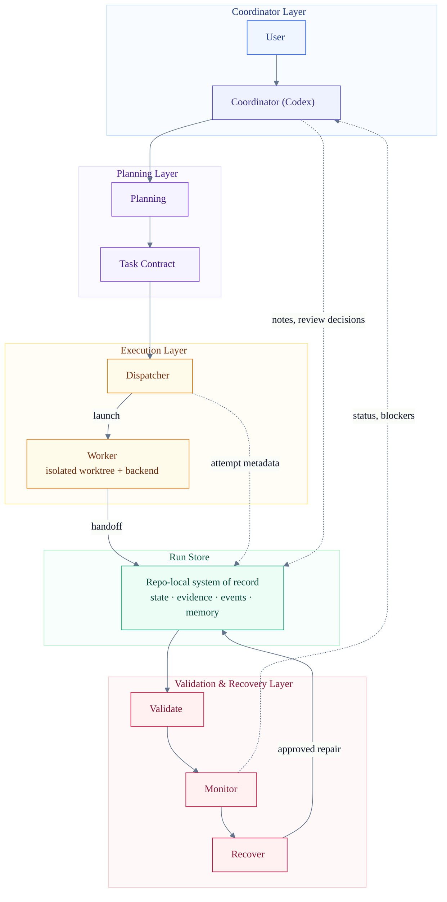
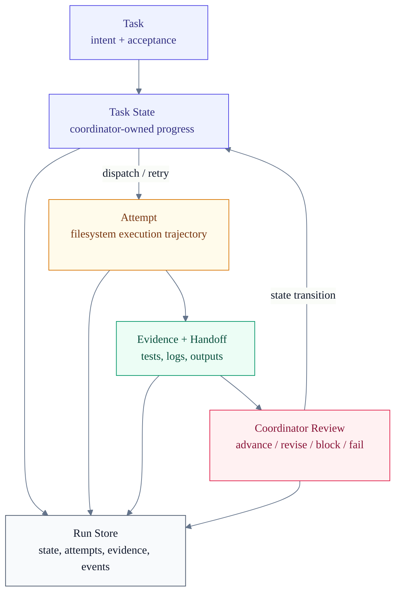
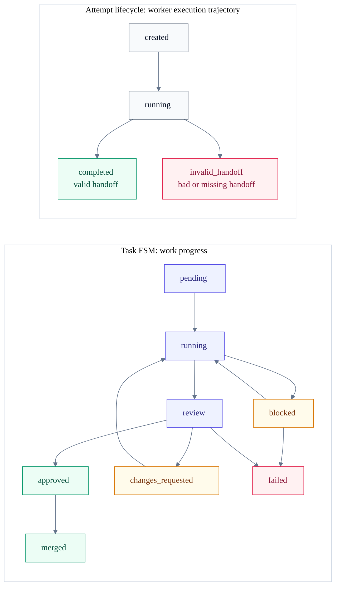

# research-dev-orchestrator

[](https://github.com/LKCY23/research-dev-orchestrator/actions/workflows/smoke.yml)

[English](README.md) | [简体中文](README.zh-CN.md)

`research-dev-orchestrator` 是一个 repo-local 的协作协议，用于把研究想法逐步推进成可复现的实验代码。它让 Codex 作为 coordinator，让 CLI coding agents 作为 worker，在不引入 server、数据库、队列或 daemon 的前提下，管理跨天/跨周的 research-dev 生命周期。

研究代码经常会持续演化：需求变化、baseline 调整、实验失败、agent 上下文丢失、结果难以审计。这个项目把长期协作过程固化成目标仓库里的 durable files。

运行入口是 [SKILL.md](SKILL.md)。完整设计基线在 [DESIGN_SPEC.md](DESIGN_SPEC.md)。

## 为什么需要它

短程 agent coding workflow 通常很好检查：一个 prompt、一个 patch、一次 review。但 research 和 experiment development 不一样：

- 实验可能持续数天或数周。
- 需求、数据集、baseline、metric 会变化。
- 失败的尝试也很重要，因为它解释了后续设计决策。
- 可复现 artifact 和代码实现同样重要。
- Review 需要 evidence，而不只是 diff。
- 人和 agent 都会忘记上下文。

这个项目把上述长期过程变成目标仓库中的可审计文件。

## 它是什么

`research-dev-orchestrator` 是一个 Codex skill，加上一组 scripts 和 protocol templates。它帮助 Codex：

- 澄清需求和实验目标；
- 选择设计方法并记录架构决策；
- 生成带验收标准和允许修改路径的 task packet；
- 将 CLI coding agent 派发到隔离的 Git worktree；
- 用确定性的 protocol gate 校验 worker handoff；
- 收集状态、证据、诊断信息和长期记忆；
- 在 merge 前支持基于 evidence 的 Codex/human review。

它刻意保持轻量：核心机制是 files + Git。

## 核心设计

这个设计围绕四条规则：

1. **Codex owns intent**
   需求、实验设计、任务拆分、验收标准、review 和 merge 决策都由 coordinator 负责。

2. **Workers own execution**
   Worker 接收一个 task packet，在一个 branch/worktree 中工作，并写入 evidence 和 handoff request。最终的 `STATUS.json` 终态 transition 由 dispatch 负责。

3. **Filesystem is the protocol**
   Agent 之间通过 repo-local 文件通信，例如 `STATUS.json`、`ATTEMPT.json`、`EVENTS.ndjson` 和 `JOURNAL.md`。

4. **Git is the isolation boundary**
   每个 task 使用独立 branch/worktree。Worker 不直接 merge。

## Architecture



这个架构围绕 ownership boundary 组织。Coordinator 负责 intent 和 review 决策，worker 负责有边界的执行，Git 隔离代码修改。Run Store 是 repo-local system of record，保存 task state、attempt lifecycle、handoff evidence、events、memory、results 和 recovery context。Validation gate 校验 worker handoff；monitoring scripts 生成 derived artifacts，但不会变成长期运行的服务。Monitor 输出为 coordinator review 提供上下文，recovery 只会把用户批准的最小变更写回 Run Store。

实现细节不主导架构图：

| Plane | Responsibility | Main implementation |
| --- | --- | --- |
| Coordinator | 需求、设计、任务拆分、review、merge 决策 | `SKILL.md`, `$research-dev-orchestrator` intent surface |
| Planning | 持久化研究意图和任务契约 | `REQUIREMENTS.md`, `DESIGN_BRIEF.md`, `ADR/`, `EXPERIMENT_PLAN.md`, `TASK.md`, `ACCEPTANCE.md` |
| Execution | Worker 派发、attempt supervision、Git 隔离执行 | `dispatch_claude.sh`, `dispatch_assets.py`, plain/tmux backends, Git worktree |
| Run Store | task state、attempt lifecycle、handoff evidence、event timeline、memory、results、recovery context 的 repo-local system of record | `.agent-collab/runs/<run-id>/`, `STATUS.json`, `ATTEMPT.json`, `EVIDENCE.md`, `HANDOFF.md`, `EVENTS.ndjson`, `JOURNAL.md`, `RESULT_LEDGER.md` |
| Validation & recovery | 确定性 gate、只读 audit、derived reports、用户批准的 recovery | `validation.py`, `protocol_cli.py`, `collect_status.py`, `SUMMARY.md`, `diagnostics/` |

## Workflow

预期流程是顺序的，但可以随时 resume：

```text
requirements
-> design method selection
-> architecture / experiment design
-> task packet
-> dispatch
-> worker handoff
-> collect status
-> Codex review
-> merge
-> close session
```

一个 run 会记录完整生命周期：需求、设计笔记、实验计划、任务、attempt、review、结果、诊断和记忆。

## Protocol Files

目标仓库会得到一个本地 `.agent-collab/` 目录：

```text
.agent-collab/
  rdo.toml
  runs/
    <run-id>/
      RUN.json
      SUMMARY.md
      dashboard.html
      EVENTS.ndjson
      JOURNAL.md
      EXPERIMENT_PLAN.md
      REPRODUCIBILITY.md
      RESULT_LEDGER.md
      tasks/
        <task-id>/
          TASK.md
          CONTEXT.md
          ACCEPTANCE.md
          STATUS.json
          EVIDENCE.md
          HANDOFF.md
          HANDOFF.json
          attempts/
            <attempt-id>/
              ATTEMPT.json
              prompt.md
              transcript.log
              result.md
```

关键文件：

- `STATUS.json`：task progress 和 FSM state。
- `ATTEMPT.json`：某一次 worker execution 的 lifecycle。
- `EVENTS.ndjson`：append-only 的机器可读 timeline。
- `JOURNAL.md`：人类可读的 session memory。
- `SUMMARY.md`：由 `collect_status.py` 生成的 derived dashboard。
- `dashboard.html`：由 `render_dashboard.py` 生成的人类可读 derived monitor。
- `EVIDENCE.md`：commands、tests、metrics、outputs 和 logs。
- `HANDOFF.md`：worker handoff summary 和 known limitations。
- `HANDOFF.json`：worker 请求进入 `review` 或 `blocked` 的机器可读 handoff request。

协议细节见 [references/state-machine.md](references/state-machine.md)、[references/status-schema.md](references/status-schema.md)、[references/attempt-lifecycle.md](references/attempt-lifecycle.md) 和 [references/events-schema.md](references/events-schema.md)。

## Execution State Model: Tasks and Attempts

执行状态模型把 work progress 和 worker execution 分开。

Task 是持久化工作项：intent、constraints、acceptance criteria，以及 coordinator-owned progress。Attempt 是某个 task 下的一次有边界 worker execution trajectory，以 attempt directory 的形式物化，包含 prompt、runtime metadata、transcript、result、evidence 和 handoff request。

Dispatch 是 worker execution 和 task state 之间的边界：attempt 可以请求进入 `review` 或 `blocked`，但必须由 dispatch 校验后才能修改 `STATUS.json`。Coordinator review 则是后续 `review -> approved|changes_requested|failed` 的边界。





Worker 失败会先影响 attempt，而不是直接让 task 失败。Completed attempt 是 review-ready evidence，不是自动 task completion。这样系统可以 retry、inspect、compare 和 recover worker executions，同时不丢失 task 的 intent 或历史。

## Runtime Backends

支持两种 worker execution backend：

- `plain`：默认，由 `dispatch_claude.sh` 直接执行。
- `tmux`：适合长任务，可以 attach 查看 worker。

tmux backend 从 dispatch 的协议视角看仍然是同步的。它不是 daemon、watcher、queue 或 source of truth。完成状态由 attempt-local `exit_code` 文件和经过校验的 protocol files 决定，不由 tmux session state 决定。

见 [references/runtime-backends.md](references/runtime-backends.md) 和 [references/lock-recovery.md](references/lock-recovery.md)。

## Long-Term Memory

长期 research work 需要显式记忆：

- `SUMMARY.md`：当前 dashboard。
- `JOURNAL.md`：人类 session notes 和 next actions。
- `EVENTS.ndjson`：append-only 机器 timeline。
- `RESULT_LEDGER.md`：实验结果和 claim support。
- `reviews/`：Codex/human review records。
- `tasks/*/attempts/`：worker execution records。

目标是几周后用户或 Codex 仍然能回答：发生了什么、为什么变化、什么失败过、有什么证据、还有什么 blocker。

## Installation

把这个仓库作为 Codex coordinator 侧的 skill 安装：

```bash
mkdir -p ~/.codex/skills
git clone https://github.com/LKCY23/research-dev-orchestrator.git \
  ~/.codex/skills/research-dev-orchestrator
```

只有 coordinator 需要安装这个 skill。Claude Code 或其他 CLI worker 不需要安装 skill；dispatch 会把 task packet 路径和 protocol instructions 传给 worker。Worker 只需要可用的 CLI command，例如：

```bash
export CLAUDE_CODE_CMD=claude
```

如果要打包成更干净的最终 skill package，请保留 `SKILL.md`、`references/`、`scripts/`、`templates/` 和 `agents/openai.yaml`；`README.md`、`README.zh-CN.md`、`DESIGN_SPEC.md`、`.github/` 和 `tests/` 是开发 artifact。

## Quick Start

在目标仓库中，让 Codex 使用这个 skill：

```text
使用 $research-dev-orchestrator，为一个可复现的 RAG benchmark pipeline 初始化 run。
```

你也可以用 Codex 内置的 `/skills` picker 选择这个 skill，然后用自然语言提出同样的请求。这里的示例是 skill invocation 和 intent phrase，不是这个 skill 注册出来的自定义 slash command。

然后 Codex 应该：

1. 和你澄清需求与实验细节；
2. 在 `.agent-collab/runs/<run-id>/` 下创建 run；
3. 创建带验收标准的 task packet；
4. 在 task 准备好后派发 CLI worker；
5. 收集状态并 review worker evidence；
6. 在 session closeout 时更新 `SUMMARY.md`、`JOURNAL.md` 和相关 run artifacts。

Worker 侧仍然是 CLI-based。你可以通过 `.agent-collab/rdo.toml` 或环境变量配置默认值，例如 `CLAUDE_CODE_CMD`、`RDO_WORKER_BACKEND` 和 `RDO_TMUX_KEEP_SESSION`。

### Direct script usage

如果是在开发、调试，或者不依赖 Codex skill discovery，可以 clone 这个仓库，然后从目标仓库中用绝对路径调用 scripts：

```bash
git clone https://github.com/LKCY23/research-dev-orchestrator.git
export RESEARCH_DEV_ORCHESTRATOR_HOME=/path/to/research-dev-orchestrator
```

初始化 run：

```bash
python "$RESEARCH_DEV_ORCHESTRATOR_HOME/scripts/init_run.py" \
  --project-slug rag-benchmark \
  --objective "Build a reproducible RAG benchmark pipeline" \
  --target-branch main
```

创建 task：

```bash
python "$RESEARCH_DEV_ORCHESTRATOR_HOME/scripts/create_task.py" \
  --run-id <run-id> \
  --task-id T001-data-loader \
  --goal "Implement the dataset loader and smoke tests" \
  --allowed-paths src tests
```

派发 worker：

```bash
"$RESEARCH_DEV_ORCHESTRATOR_HOME/scripts/dispatch_claude.sh" <run-id> T001-data-loader
```

收集状态：

```bash
python "$RESEARCH_DEV_ORCHESTRATOR_HOME/scripts/collect_status.py" --run-id <run-id>
python "$RESEARCH_DEV_ORCHESTRATOR_HOME/scripts/collect_status.py" --run-id <run-id> --write-summary
```

关闭 session：

```bash
python "$RESEARCH_DEV_ORCHESTRATOR_HOME/scripts/close_session.py" \
  --run-id <run-id> \
  --summary "Implemented loader first pass and identified schema blocker."
```

## Example Usage

当你希望 attach 到长时间运行的 worker 时，使用 tmux backend：

```bash
RDO_WORKER_BACKEND=tmux \
  "$RESEARCH_DEV_ORCHESTRATOR_HOME/scripts/dispatch_claude.sh" <run-id> T001-data-loader
```

Operational defaults 位于 `.agent-collab/rdo.toml`，但 protocol truth 不可配置。Config 可以选择 backend、worker command、stale thresholds、task path prefixes 等默认值。它不能改变 FSM states、blocker types、event types、protocol version 或 review semantics。

见 [references/configuration.md](references/configuration.md)。

## Monitoring

项目提供四层 monitor：

- Visual monitor：`.agent-collab/runs/<run-id>/dashboard.html`。
- Human-readable summary：`.agent-collab/runs/<run-id>/SUMMARY.md`。
- Interactive monitor：`python "$RESEARCH_DEV_ORCHESTRATOR_HOME/scripts/collect_status.py" --run-id <run-id>`。
- Machine-readable monitor：`python "$RESEARCH_DEV_ORCHESTRATOR_HOME/scripts/collect_status.py" --run-id <run-id> --json`。

用下面的命令重新生成 visual dashboard 和人类可读 summary：

```bash
python "$RESEARCH_DEV_ORCHESTRATOR_HOME/scripts/render_dashboard.py" \
  --run-id <run-id>
```

```bash
python "$RESEARCH_DEV_ORCHESTRATOR_HOME/scripts/collect_status.py" \
  --run-id <run-id> \
  --write-summary
```

`dashboard.html` 和 `SUMMARY.md` 是 derived monitors，不是 protocol truth。真源仍然是 `RUN.json`、task `STATUS.json`、attempt `ATTEMPT.json`、`EVENTS.ndjson`、`EVIDENCE.md`、`HANDOFF.md`、`HANDOFF.json` 和 `RESULT_LEDGER.md`。Protocol warnings 和 recovery snapshots 会写到 `diagnostics/`。

## Versioning

本项目在 [VERSION](VERSION) 中记录两类版本：

- `PACKAGE_VERSION`：可安装 skill / repo 的发布版本。
- `PROTOCOL_VERSION`：写入 `RUN.json` 的 Run Store 文件协议版本。

Package release 会声明它实现的 protocol version，但 patch release 可以保持同一个 protocol version。只有 Run Store schema、FSM transitions、event format 或目录结构变化时，才需要升级 protocol version。

## Validation and CI

CI 会在 push 到 `main` 和 pull request 时自动运行。它不需要 secrets，也不会调用真实 model-backed workers。

Smoke tests 使用 fake workers。它们验证 protocol 和 orchestration 行为，不消耗 model/API budget：

- Python scripts compile。
- Bash scripts parse。
- Skill metadata valid。
- Protocol smoke tests pass。
- `git diff --check` pass。

本地等价检查：

```bash
python3 .github/ci/quick_validate_skill.py .
python3 -m py_compile scripts/*.py .github/ci/quick_validate_skill.py
bash -n scripts/dispatch_claude.sh scripts/run_smoke_tests.sh tests/smoke/*.sh
RDO_KEEP_SMOKE_REPOS=0 scripts/run_smoke_tests.sh
git diff --check
```

本地调试时，可以去掉 `RDO_KEEP_SMOKE_REPOS=0` 来保留临时 smoke-test repositories。

## Repository Layout

```text
SKILL.md                 # Codex skill runtime entrypoint
README.zh-CN.md          # Simplified Chinese README
DESIGN_SPEC.md           # Full design baseline and protocol rationale
LICENSE                  # MIT license
VERSION                  # Package and Run Store protocol versions
CHANGELOG.md             # Release history
references/              # FSM, schemas, review rubric, workflow and memory docs
scripts/                 # protocol, config, validation, dispatch, collect, close_session
templates/               # Scaffold source for run and task files
tests/smoke/             # Protocol and dispatch smoke tests using fake workers
agents/openai.yaml       # Codex UI metadata
.github/workflows/       # GitHub Actions smoke CI
```

如果将它打包成最终 Codex skill，请包含 `SKILL.md`、`references/`、`scripts/`、`templates/` 和 `agents/openai.yaml`。`README.md`、`README.zh-CN.md`、`DESIGN_SPEC.md`、`.github/` 和 `tests/` 可以保留为开发 artifact。

## Design Boundaries

它不是：

- server；
- RPC framework；
- queue；
- daemon；
- automatic code reviewer；
- Codex/human review 的替代品；
- 自动修复 corrupted protocol truth 的系统。

Agent 写入永远不能被默认信任。确定性 validation 会 gate 它们。Validation 可以把 handoff 标记为 invalid，但语义修复需要 coordinator/user review。

## Roadmap

- 更好的 Codex skill 安装打包。
- 更多 protocol validators 和 recovery review helpers。
- 可选 real-worker integration tests。
- 更多 research experiment workflow 示例。
- 可选 argv-array worker command mode。

## Contributing

提交 pull request 前，请运行上面的本地等价 CI。

修改 protocol behavior 时：

- 更新 `references/` 中相关文件；
- 更新 smoke tests；
- 保持常量在 `scripts/protocol.py`；
- 保持共享 validation rules 在 `scripts/validation.py`；
- 不要把 coordinator-only decisions 放进 `scripts/protocol_cli.py`。

请不要在没有 design discussion 的情况下添加 server、daemon、RPC layer、queue 或 automatic protocol repair。

## License

MIT. See [LICENSE](LICENSE).
